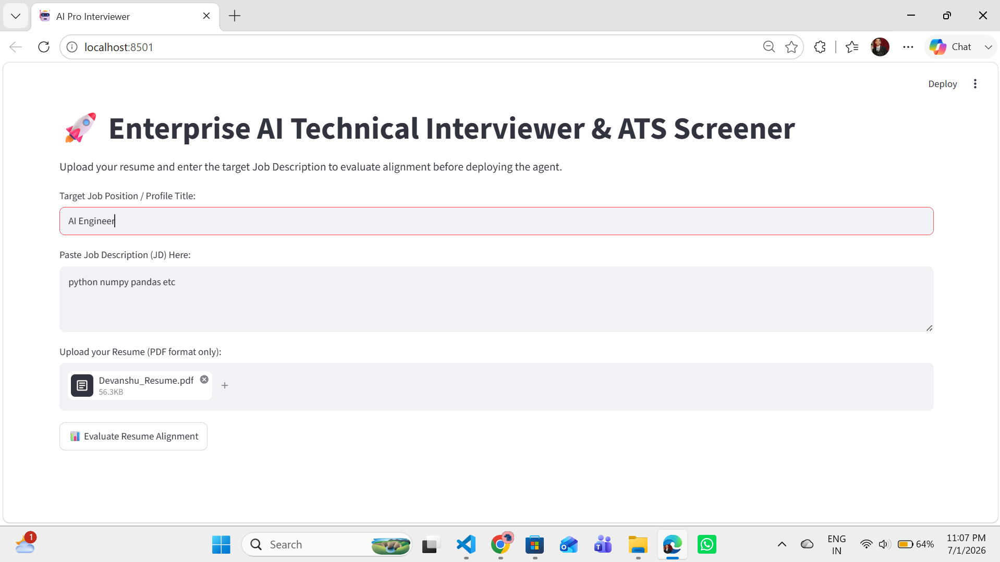
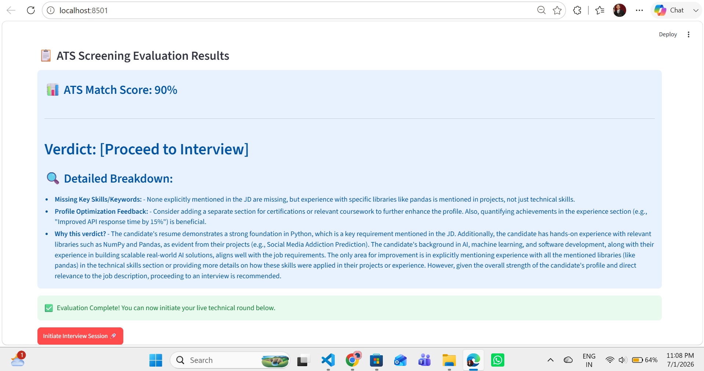
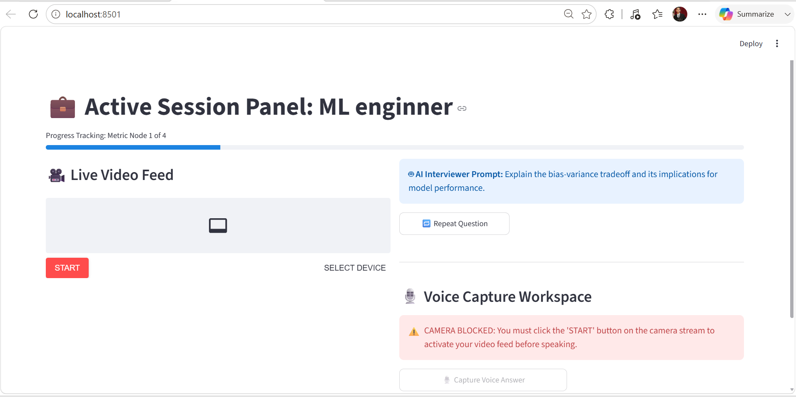
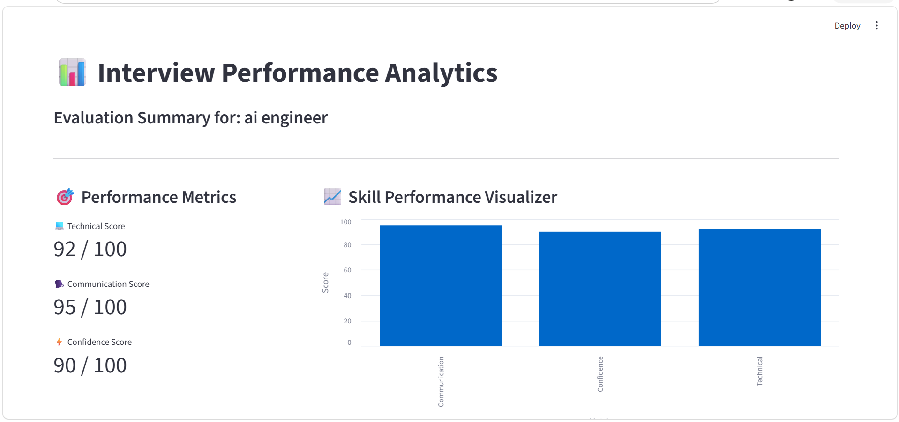
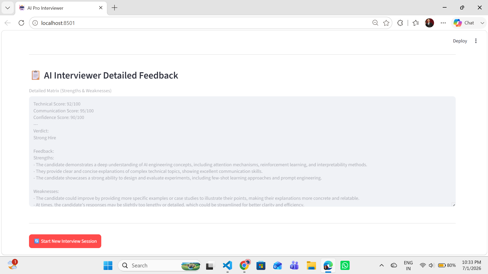

# 🤖 Enterprise AI Technical Interviewer & ATS Screener

An advanced, production-grade GenAI Mock Interview platform built using **Streamlit**, **Groq Cloud API (Llama 3.3 70B)**, **pypdf**, and **WebRTC/STT Engines**. The application dual-functions as a smart ATS Resume-JD alignment checker and a live simulator for real-world corporate technical rounds with continuous context-aware dynamic questioning, instant speech-to-text processing, automatic voice feedback, and a complete metric analytics dashboard.

---

## 🚀 Key Features

* **Advanced ATS Screening Matrix:** Extracts text from candidate resume PDFs (`pypdf`) and matches it against the target Job Description (JD) using Groq LLM to yield match percentages, missing keywords, and profile optimization verdicts before initiating the live round.
* **Dynamic Context-Aware Questioning:** Uses state-of-the-art LLMs via Groq to generate progressive, non-scripted follow-up questions based on previous candidate answers and evaluated profile alignment.
* **Audio Orchestration Engine:** Incorporates native browser TTS (Google Text-to-Speech) loops that read questions automatically, complete with a **Repeat Question** manual override function.
* **Anti-Bypass Camera Validation:** Security logic monitors WebRTC video tracks; voice recording and audio pipelines are strictly locked/disabled until the camera feed is live.
* **Interactive Analytics Dashboard:** Parses evaluation metrics dynamically to render real-time comparative charts scoring Technical Depth, Communication, and Confidence.
* **Production Architecture:** Fully modular code separation dividing concerns into AI Logic, Voice Processing, and UI Components layers.

---

## 📸 Application Walkthrough & Screenshots

### 1. Initial Profile Setup & ATS Screening Screen
*Before the session begins, the candidate inputs the target job profile, pastes the target Job Description, and uploads their resume PDF to evaluate alignment matrix.*



### 2. ATS Screening Evaluation Results
*Once the alignment matrix evaluation finishes, the system locks/unlocks the live interview round depending on target parameters, displaying a detailed breakdown of verdicts and profile modifications.*



---

### 3. Live Interview Interface
*Once active, the system injects automatic question audio, locks verification metrics, monitors the real-time camera track, and waits for voice capture pipelines to initiate.*



---

### 4. Post-Interview Performance Analytics
*After completing the set number of questions, the system aggregates session logs, parses the text stream, and displays a dynamic performance chart along with granular strengths and weaknesses analysis.*




---

## 📂 Project Structure

```text
ai-pro-interviewer/
│
├── core/
│   ├── __init__.py
│   ├── ai_engine.py      # Groq LLM Integration, ATS Engine & Error-Proof Prompts
│   └── voice_engine.py   # Base64 Audio TTS & Speech-to-Text pipelines
│
├── ui/
│   ├── __init__.py
│   ├── components.py     # Camera, WebRTC and layout components
│   └── dashboard.py      # Scorecard Analytics Charts & Feedback UI
│
├── app.py                # Main Router / Controller Node
├── requirements.txt      # Python Dependencies (Streamlit, pypdf, groq, etc.)
├── .env                  # Environment API Keys (Private)
└── README.md             # Project Documentation